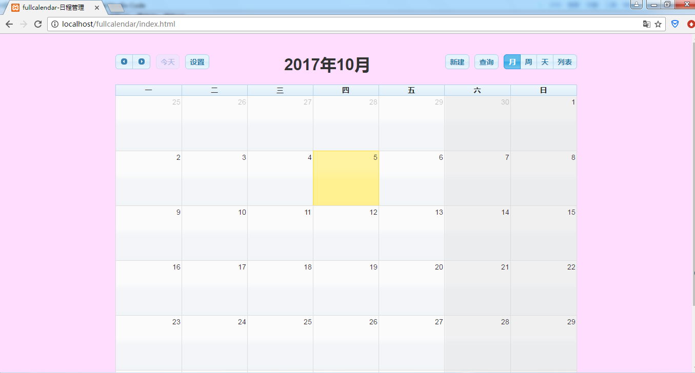
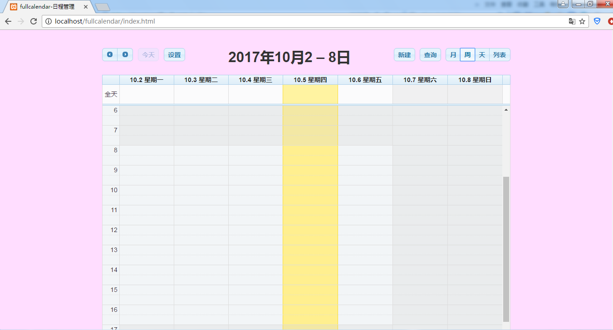
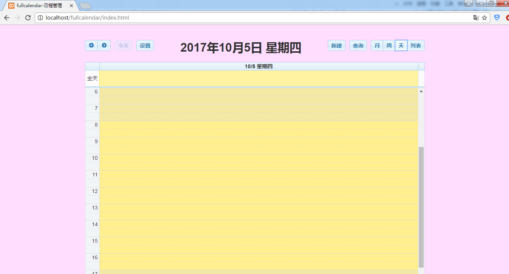
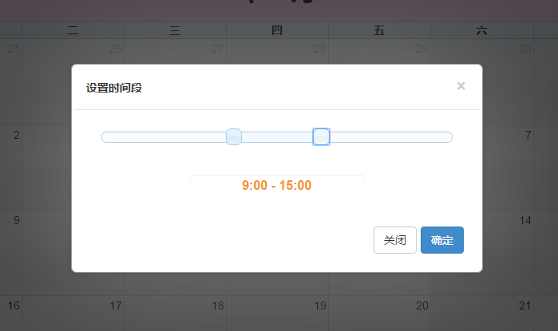
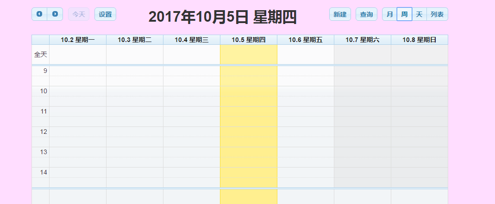
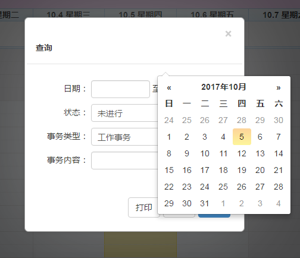
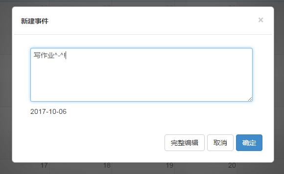
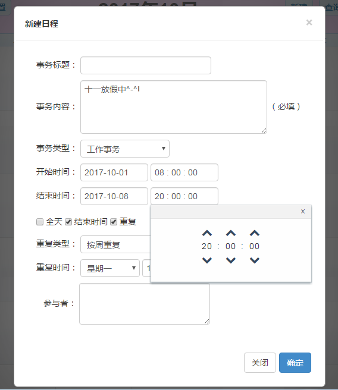
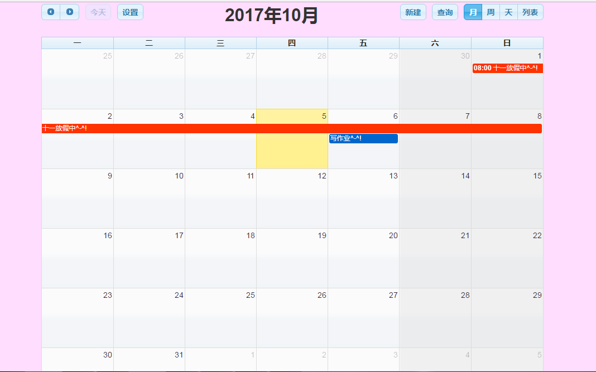
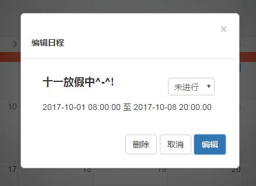

###  基于fullcalendar制作的日程管理小demo
#### 一、项目功能概述：
该项目是基于`fullcalendar`而制作的日程管理，`fullcalendar`是一个基于`jquery`的日历插件，在该项目中，我们可以在日历上编辑我们的日程，并将日程通过日视图、周视图、月视图的方式来进行展示，也可以通过选择时间段来展示我们的日程。该项目使用`artDialog`来制作弹出框的效果，使用`wickedpicker`和`bootstrap-datapicker`来作为我们的时间选择插件，还选择了`jquery-ui`当中的`slider`来制作设置时间段的滑块效果。

该项目虽然没有建立后台数据库，只是用了两个`php`文件来暂时的存储我们编辑的日程，但在运行该项目的时候，仍然需要将其放在本地服务器的环境下。因为我们编辑完日程后，是通过`ajax`的方式提交给后台，然后再从后台取数据渲染更新到我们的日历上，不过由于没有把日程数据存到数据库，故刷新页面之后，我们编辑的日程会消失。
> 代码当中涉及`ajax`交互数据的这两个后台文件的地址分别为`http://localhost/fullcalendar/detail.php`和`http://localhost/fullcalendar/events.php`。故在运行该项目时，先把该项目文件夹的名字改为`fullcalendar`，然后再将其放在本地服务器的环境当中。

#### 二、项目细节展示：
我们的日程管理日历当中的月视图、周视图、日视图分别为：

当我们点击标题栏左侧的设置按钮，会弹出如下的弹出框，可以通过滑块来设置时间段（以小时为单位），在确定之后就完成了我们的周视图和日视图当中每天展示的时间段的设置。

当我们点击标题栏右侧的查询按钮，会弹出如下的弹出框：

我们在月视图、周视图、日视图当中用鼠标点击某一天会弹出如下的弹框，我们可以在此编辑那天的日程，在此不进行更多详情的填写，点击确定之后，就会在日程视图上呈现。

如果需要填写更详细的日程内容，可以点击上述弹出框当中的完整编辑按钮，则会弹出新建日程页面。（我们点击日历标题栏右侧的新建按钮也会弹出如下弹框）。在该弹框当中我们以事务内容的编辑为准，忽略事务标题，在这里我们可以选择更详尽的日程时间段，可以设置开始和结束时间段。当我们勾选全天时，则后边的时刻点消失；当勾选结束时间的时候，才会显示结束时间的设置；当勾选重复的时候，才会提供重复类型的选择，当我们在下拉列表当中选择不同的重复类型的时候，下面对应的重复时间会有不同的展示。当编辑完成，点击确定之后，日程事件就会展示在日历上了。

我们用鼠标点击日历上某一个已建日程时，会弹出如下弹框，点击编辑则会进入编辑界面，对该日程事件进行编辑，确定后则日程更改，点击删除，则可以删除该日程。

